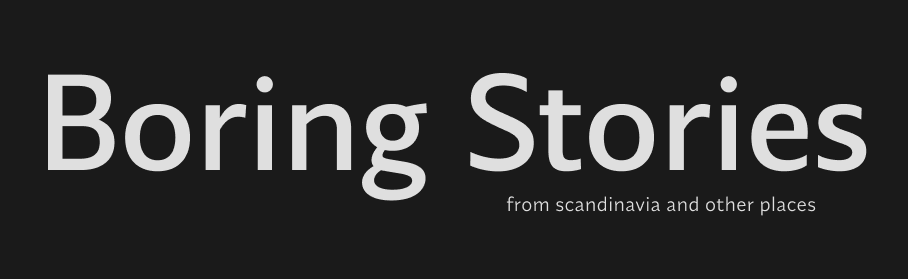

[![Stargazers][stars-shield]][stars-url]
[![LinkedIn][linkedin-shield]][linkedin-url]

 

    

  <h3 align="center">Boring Stories - photographer's blog</h3>

  

     
     
    <a href="https://boring-stories.netlify.app">View Demo</a>
    ·
    <a href="https://dribbble.com/shots/23010524-Boring-Stories-UI">View UI design</a>
  

## About The Project

(<a href="#readme-top">back to top</a>)

### Built With

* [![React][React.js]][React-url]

(<a href="#readme-top">back to top</a>)

React, Redux Toolkit, Tailwind, Framer Motion  
Backend: Node.js, Express, MongoDB
